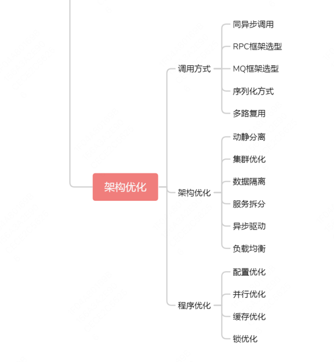

## 系统问题的回答层次
1. 谈复杂来源
   1. 从功能性复杂度方面来看（如：架构上各业务子系统强耦合）
   2. 从非功能性复杂度方面来看（如：QPS、吞吐、高性能、高可用等）
2. 谈解决方案 
   1. 针对功能和非功能性的复杂度谈解决方案，2-3套，确定技术的可行性和优缺点
3. 谈评估标准 
   1. 通用的设计原则，如设计松耦合、系统可监控、系统可降级等
   2. 必须实现功能需求，可选择性的实现非功能需求
4. 说技术实现
   1. 进一步说明技术上的落地实现方式和深层原理（有几种实现方式？各自的优缺点有哪些？）

## 面试回答问题的层次
1. 展示理论深度。你可以从一个熟知的知识点出发，深入浅出地回答，比如它的工作原理、优劣势、适用场景等。
2. 结合落地经验。你不能仅停留在理论理解，还要结合落地方案的技术实现，这样才能体现你的技术闭环思维。
3. 展示知识体系，这是任何一个程序员向上发展的基础能力。理论深度和落地经验体现了作为程序员的基本素质，而知识体系和技术判断力则体现了你是否达到架构师的能力边界。

## 在分布式系统中，核心的考察点包括了分布式系统中数据的存储、分布、复制，以及相关协议和算法
### 存储
- 存储指分布式存储系统，你要理解什么是分布式存储系统？为什么选型分布式存储系统？以及分布式存储中关注哪些问题？
1. 首先，为了解决数据的水平扩展，要做数据分片，因为分布式系统区别于传统单机系统就在于能将数据分布到多个节点，并在多个节点间实现负载均衡。这种数据水平扩容的操作叫数据分片。
2. 数据分片会涉及分片规则，常见的有范围分片和哈希分片，不同的分片规则就有不同的分片算法，如哈希分片就会涉及哈希取模算法、虚拟桶算法、一致性哈希算法。 
3. 又因为数据要分布到多个节点，你还需要数据复制，数据复制就会存在同步复制和异步复制。为了保证数据的可靠性和可用性，增强系统容错，数据复制就会产生副本，副本则是分布式存储系统解决高可用的唯一手段。 
4. 而多个副本同步会产生一致性的问题，从而引出一致性问题的分类，如强一致性、弱一致、最终一致，要想解决一致性问题，会涉及一致性问题的协议：如两阶段提交协议（Two-PhraseCommit，2PC）、Paxos协议选举、向量时钟（VectorClock）、RWN协议、Raft协议。 
5. 多个副本还会带来主选举，这会涉及分布式锁的问题：多个机器竞争一个锁，当某个机器释放锁或者挂掉，其他机器可以竞争到锁，继续执行任务。为了解决锁的容错性，比如解决双主（脑裂）问题，就会涉及租约机制，租约机制可以解决网络分区问题造成的“双主”问题。 
6. 最后，为了衡量副本可用性和一致性，就会引出分布式系统的基础理论 CAP 、BASE，以及 PACELC。
- 虚拟桶算法、一致性哈希算法
  - 虚拟桶：
  - 一致性哈希：

### 计算
- 分布式计算就会涉及三个概念：并行计算、分布式计算、云计算。
1. 并行计算：同时使用多种计算资源解决计算问题的过程，比如多线程就是一种并行计算；服务集群也是一种并行计算。
2. 分布式计算：是从集群技术发展而来，区别在于集群虽然连接了多台机器，但某项具体的任务执行时还是会被转发到某台服务器上，分布式计算则将任务分割到多台服务器上并行计算，然后得到结果。
3. 云计算：分布式计算 + 虚拟化技术的综合技术的统称，不同商业公司有着各自不同的定义，通俗来讲就是开发者利用云 API 开发应用，然后上传到云上托管，并提供给用户使用，而不关心云背后的运维和管理，以及机器资源分配等问题。
### 输入输出
- 系统架构中的输入输出，是指系统间通信的技术。
- 其中会涉及一些基础知识，比如网络通信最基础的协议（诸如 TCP/UDP 协议等）；网络 I/O 模型（Blocking-IO，NonBlocking-IO、Asyn-IO），最后是偏应用的知识，需要了解例如连接复用、序列化/反序列化、RPC、MQ 消息队列等。
1. 网络设备如何处理流量？这会涉及中断和缓存。
2. 操作系统如何处理流量？这会涉及 I/O 模型，select、poll、epoll，以及 I/O 多路复用。 
3. 应用系统如何处理流量？这会涉及 NIO 的开发，如 Reactor 模式、Netty 框架原理等。 
4. 系统线程如何处理流量？还会涉及多线程的设计模式。 
5. 最后，你还要掌握分布式系统通信的核心技术：RPC 和 MQ。
- Netty 框架原理
  - 
### 控制器
- 你可以把分布式系统知识体系中的控制器，理解为系统架构中的调度系统，包括流量调度和资源调度。
1. 流量调度（我们常说的流量控制）
   - 比如负载均衡、服务路由、熔断、降级、限流等，其实常用的高可用、高性能的解决方案很多都是基于流量上的调度。
2. 资源调度
   - 如果我们将流量调度迁移到服务器的计算资源、存储资源或基础资源上面的话，
   - 就会引出另一种基于资源的调度，如 Mesos、Yarn 基于计算资源的调度；HDFS、GlusterFS、Ceph 基于存储资源的调度；Kubernetes、Mesos 基于容器资源的调度（包括计算、存储、网络等综合性的资源调度）。
3. 总的来说，你至少要掌握常用系统调度设计，调度算法与负载策略。
   - 举个例子，如果让你对单个服务器的计算资源做调度，你至少要具备设计思路：让集群选举一个主节点，每个从节点会向主节点汇报自己的空闲资源，当请求到来时，主节点通过资源调度算法选择一个合适的从节点来处理该请求。
   

### 海量数据的存储设计
- 基于 Hash 取模、一致性 Hash 实现分库分表（常规的 Hash 取模分片方式）

### 共识算法
- 

### ETCD 是如何解决数据共识问题的？为什么要选择这种数据复制方式呢？
- A：ETCD 的共识算法是基于 Raft 协议实现的强一致性算法，同类的强一致性算法还有 Paxos
- Q：为什么没有选择 Paxos 而选择了 Raft？ 
  - 主要考察：Paxos 算法解决了什么问题？ Basic Paxos 算法的工作流程是什么？ Paxos 算法和 Raft 算法的区别又是什么？
- A：
  - 在分布式系统中，造成系统不可用的场景很多，比如服务器硬件损坏、网络数据丢包等问题，解决这些问题的根本思路是多副本，
  - 副本是分布式系统解决高可用的唯一手段， 也就是主从模式，那么如何在保证一致性的前提下，提高系统的可用性，
  - Paxos 就被用来解决这样的问题，而 Paxos 又分为 Basic Paxos 和 Multi Paxos，然而因为它们的实现复杂，工业界很少直接采用 Paxos 算法，
  - 所以 ETCD 选择了 Raft 算法 （在面试过程中，面试官容易在这里设置障碍，来对候选者做技术分层）。
    - Raft 是 Multi Paxos 的一种实现，是通过一切以领导者为准的方式，实现一系列值的共识，然而不是所有节点都能当选 Leader 领导者，Raft 算法对于 Leader 领导者的选举是有限制的，
    - 只有最全的日志节点才可以当选。正因为 ETCD 选择了 Raft，为工业界提供了可靠的工程参考，就有更多的工程实现选择基于 Raft，如 TiDB 就是基于 Raft 算法的优化。
#### 分片元数据服务毕竟是一个中心化的设计思路，而且基于强一致性的共识机制还是可能存在性能的问题，有没有更好的架构思路呢？
- 考察Gossip协议
  - Gossip 的协议原理有一种传播机制叫谣言传播，指的是当一个节点有了新数据后，这个节点就变成了活跃状态，并周期性地向其他节点发送新数据，直到所有的节点都存储了该条数据。
  - 这种方式达成的数据一致性是 “最终一致性”，即执行数据更新操作后，经过一定的时间，集群内各个节点所存储的数据最终会达成一致，很适合动态变化的分布式系统。
- 如果副本少、参与共识的节点少，推荐采用广播方式，如 Paxos、Raft 等协议。如果副本多、参与共识的节点多，那就更适合采用 Gossip 这种最终一致性协议。

### 分布式事务
- 分布式事务是指跨越多个数据库、服务或资源的事务操作
- 我建议你先介绍目前主流实现分布式系统事务一致性的方案（也就是基于 MQ 的可靠消息投递的机制）然后回答出可实现方案和关键知识点。
- 另外，为了和面试官进一步交流，你可以提出 2PC 或 TCC （这是一种交流方案）
- 因为 2PC 或 TCC 在工业界落地代价很大，不适合互联网场景，所以只有少部分的强一致性业务场景（如金融支付领域）会基于这两种方案实现。
- 而你可以围绕它们的解决思路和方案弊端与面试官讨论，这会让你和面试官由不平等的“面试与被面试”变成平等且友好的“双方沟通”，是一种面试套路。
#### XA 是由 X/Open 组织提出的分布式事务的规范
- 规范主要定义了事务管理器（Transaction Manager）和资源管理器（Resource Manager）之间的接口，事务管理器负责全局事务的协调者，资源管理器负责管理实际资源（如 MySQL、Oracle 等数据库）。
- Java 平台上事务规范 JTA（Java Transaction API）就是对 XA 分布式事务规范标准的实现
  - 例如在 Spring 中就通过 JtaTransactionManager 来配置分布式事务，然后通过管理多个 ResourceManager 来管理多个数据源，进而操作多个数据库之间的事务。
#### 2PC
- 主要是投票和执行两个阶段
- 参考：https://learn.lianglianglee.com/%e4%b8%93%e6%a0%8f/%e6%9e%b6%e6%9e%84%e8%ae%be%e8%ae%a1%e9%9d%a2%e8%af%95%e7%b2%be%e8%ae%b2/05%20%20%e6%b5%b7%e9%87%8f%e5%b9%b6%e5%8f%91%e5%9c%ba%e6%99%af%e4%b8%8b%ef%bc%8c%e5%a6%82%e4%bd%95%e5%9b%9e%e7%ad%94%e5%88%86%e5%b8%83%e5%bc%8f%e4%ba%8b%e5%8a%a1%e4%b8%80%e8%87%b4%e6%80%a7%e9%97%ae%e9%a2%98%ef%bc%9f.md
- 可以借助数据库的本地事务操作，实现起来较为简单，不用侵入业务逻辑，
- 过程
  - 提交事务请求（投票阶段）
    - 协调者向所有的参与者发送事务内容，询问是否可以提交事务
  - 执行事务提交（执行阶段）
    - 参与者都返回yes
      - 协调者发送提交请求给所有的参与者，
      - 参与者发起提交，并返回给协调者ack消息
      - 协调者收到所有的ack，事务结束
    - 任何一个参与者返回no
      - 协调者发送 回滚请求 给所有的参与者
      - 参与者发起 回滚 ，并返回给协调者ack消息
      - 协调者收到所有的ack，完成事务中断
- 优点：原理简单，实现方便
- 缺点：
  - 同步阻塞（性能非常低）
    - 参与者都在等待其他参与者的响应，无法进行其他操作
  - 单点问题
    - 协调者是单点，在第二阶段故障时，所有参与者处于锁定事务资源且阻塞的状态
  - 数据不一致（脑裂）
    - 第二阶段，发送局部网络异常（或发送一部分后自己故障），会导致一部分参与者提交，造成数据不一致
  - 容错太差
    - 投票阶段，一个参与者故障导致投票信息未回来，则会导致事务不能正常完成，容错太差
#### 3PC
- 分为CanCommit和PreCommit、doCommit三部分（把2PC的提交事务拆分出一个PreCommit）
  - 参与者在第二阶段PreCommit就进行事务操作的执行
  - 如果此时有参与者返回no，则在第三阶段协调者会发送abort请求，参与者回滚之前的操作
- 注意：一旦进入阶段3 doCommit，参与者都会在等待超时后，自行提交事务
  - 此时协调者单点故障了（或网络故障了），也能保证事务提交
- 优点
  - 降低参与者的阻塞范围
  - 能够在单点故障后
- 缺点
  - 数据不一致（脑裂）
    - 和2PC一样，在第二阶段网络异常时，也会导致一部分参与者提交，造成数据不一致
#### TCC
  - TCC分别对应Try、Confirm和Cancel三种操作，含义如下：
    - Try：预留业务资源
      - 先把多个应用中的业务资源预留和锁定住，为后续的确认打下基础，类似的，DML操作要锁定数据库记录行，持有数据库资源。
    - Confirm：确认执行业务操作
      - 在Try操作中涉及的所有应用均成功之后进行确认，使用预留的业务资源，和Commit类似
    - Cancel：取消执行业务操作
      - 当Try操作中涉及的所有应用没有全部成功，需要将已成功的应用进行取消(即Rollback回滚)
        Raft 不是拜占庭容错(BFT) 算法：节点信任当选的领导者。
#### Raft算法
- 是一种共识算法，旨在替代Paxos系列算法。
  - 通过逻辑分离，它的目的是比 Paxos 更容易理解，但它也被正式证明是安全的，并提供了一些额外的功能。
- Raft 通过选举产生的领导者达成共识。
  - raft 集群中的服务器要么是leader要么是follower ，并且可以在选举的精确情况下成为候选人（领导者不可用）。
  - 领导者负责将日志复制到追随者。它定期通过发送心跳消息通知追随者它的存在。
  - 每个跟随者都有一个超时时间（通常在 150 到 300 毫秒之间），在此期间它期望来自领导者的心跳。
  - 超时在收到心跳时重置。如果没有收到心跳，follower 将其状态更改为 candidate 并开始 leader 选举。
- Etcd使用 Raft 来管理一个高可用的复制日志；
#### Paxos算法
- Paxos是一系列协议，用于在不可靠或易出错的处理器网络中解决共识问题。
- Google的Chubby
  - Zookeeper是其开源实现，协议是ZAB（Zookeeper Atomic Broadcast，zk原子消息广播协议），没有完全实现Paxos
#### 基于 MQ 的可靠消息投递方案
- 应对高并发场景下的分布式事务问题时，种方案通过放弃强一致性，而选择最终一致性，来提高系统的可用性。
- MQ 自动应答机制导致的消息丢失
  - 因为执行异常导致流程中断，那这时候消息中间件中就没有这个数据了，进而会导致消息丢失。
  - 因此你要采取编程的方式手动发送应答，也就是当优惠券系统执行业务成功之后，消息中间件才能删除这条持久化消息。
- 高并发场景下的消息积压导致消息丢失
  - 在网络通信的过程中，不能保证事件消息能够被及时地消费，这个消息就会被消息队列不断地重试，最后可能由于超过了最大重试次数而被丢弃到死信队列
  - 但实际上，你需要人工干预处理移入死信队列的消息，让订单知道消费执行结果的响应，即使出现了消息丢失的情况，订单系统也还是可以通过定时任务扫描的方式，将未完成的消息重新投递来进行消息补偿
    - 这是基于消息队列实现分布式事务的关键，是一种双向消息确认的机制。（可以把状态写入数据库，一段时间后状态未更改时，重新发送）

### 分布式锁
- 问题 
  - 可用问题：无论何时都要保证锁服务的可用性（这是系统正常执行锁操作的基础）。
  - 死锁问题：客户端一定可以获得锁，即使锁住某个资源的客户端在释放锁之前崩溃或者网络不可达（这是避免死锁的设计原则）
  - 脑裂问题：集群同步时产生的数据不一致，导致新的进程有可能拿到锁，但之前的进程以为自己还有锁，那么就出现两个进程拿到了同一个锁的问题。
- 基本原则
  - 互斥性：即在分布式系统环境下，对于某一共享资源，需要保证在同一时间只能一个线程或进程对该资源进行操作。 
  - 高可用：也就是可靠性，锁服务不能有单点风险，要保证分布式锁系统是集群的，并且某一台机器锁不能提供服务了，其他机器仍然可以提供锁服务。
  - 锁释放：具备锁失效机制，防止死锁。即使出现进程在持有锁的期间崩溃或者解锁失败的情况，也能被动解锁，保证后续其他进程可以获得锁。
  - 可重入：一个节点获取了锁之后，还可以再次获取整个锁资源。
#### 基于关系型数据库 MySQL 实现分布式锁；
- 步骤 
  1. 先查询数据库是否存在记录， 
  2. 为了防止幻读取，通过数据库行锁 select for update 锁住这行数据
  3. 然后将查询和插入的 SQL 在同一个事务中提交
- 交叉死锁问题
  - 比如事务 1 和事务 2 分别取得了记录 1 和记录 2 的排它锁，然后事务 1 又要取得记录 2 的排它锁，事务 2 也要获取记录 1 的排它锁，那这两个事务就会因为相互锁等待，产生死锁。
  - 通过“超时控制”解决交叉死锁的问题，在高并发场景下存在性能问题
- 基于乐观锁的方式实现分布式锁（版本号）

#### 基于分布式缓存 Redis 实现分布式锁；
- 参考 redis.md 的 **Redis如何做分布式锁以及和zk锁的区别**
- 可以基于 Redis 的 setnx 命令来实现分布式锁
  - 引申问题“分布式锁用 Zookeeper 实现行不行？”，“分布式锁用 etcd 实现行不行？”
- 步骤
  - 加锁的过程，实际上就是在给 Key 键设置一个值，为避免死锁，还要给 Key 键设置一个过期时间。
    - SET lock_key unique_value NX PX 10000
    - unique_value：客户端的唯一标识
    - 过期时间：避免客户端发生异常而无法释放锁。
  - 解锁的过程，就是将 lock_key 键删除，但不能乱删，要保证执行操作的客户端就是加锁的客户端。
    - 实现方式可以通过 lua 脚本（保证解锁操作的原子性）判断 unique_value 是否为加锁客户端
- 优点
  - 性能高效（这是选择缓存实现分布式锁最核心的出发点）。
  - 实现方便。（要选型 Redis 2.6.12 后的版本或通过 Lua 脚本执行加锁和设置超时时间）
    - Redis2.6.12 的之前的版本中，由于加锁命令和设置锁过期时间命令是两个操作（不是原子性的），当出现某个线程操作完成 setnx 之后，还没有来得及设置过期时间，线程就挂掉了，就会导致当前线程设置 key 一直存在，后续的线程无法获取锁，最终造成死锁（应该叫饥饿）的问题
  - 避免单点故障（Redis是集群部署的）
- 缺点
  - 不合理的超时时间
    - 过长，可能导致误删除操作；性能较差；
    - 过短，有可能业务阻塞没有处理完成
    - 解决：基于续约，守护线程一段时间后，重新设置这个锁的超时时间，当主线程执行完成后，销毁续约锁即可。
- 分布式锁算法 Redlock
  - 让客户端和多个独立的 Redis 实例依次请求申请加锁，如果客户端能够和半数以上的实例成功地完成加锁操作，那么我们就认为，客户端成功地获得分布式锁，否则加锁失败。
  - 即使有某个 Redis 实例发生故障，因为锁的数据在其他实例上也有保存，所以客户端仍然可以正常地进行锁操作，锁的数据也不会丢失
    
### 系统中引入MQ
- 系统解耦，但会影响系统之间数据传输的一致性
- 削峰填谷，但消费端处理能力不足会导致消息积压
#### 消息如何保证不丢失
- 如何知道有消息丢失？
  - 消息生产，塞到MQ，拿到ACK
  - 消息存储，由MQ本身来保证（如至少2台机器写入成功后再返回ACK）
  - 消息消费，完成业务逻辑后再发送消息确认
- 哪些环节可能丢消息？
- 如何确保消息不丢失？
  - 全局ID，在生产和消费端保持ID一致
    - 实现方法有数据库自增主键、UUID、Redis，Twitter-Snowflake 算法 
 
#### 怎么解决消息被重复消费的问题（消费端幂等）
#### 消息积压了怎么办（一般是消费端的性能问题）
  - 线上突发问题：要临时扩容，增加消费端的数量，与此同时，降级一些非核心的业务。通过扩容和降级承担流量
  - 其次，才是排查解决异常问题，如通过监控，日志等手段分析是否消费端的业务逻辑代码出现了问题，优化消费端的业务处理逻辑。
  - 最后，如果是消费端的处理能力不足，可以通过水平扩容来提供消费端的并发处理能力，但这里有一个考点需要特别注意， 
    - 那就是在扩容消费者的实例数的同时，必须同步扩容主题 Topic（Kafka单实例消费单分区） 的分区数量，确保消费者的实例数和分区数相等。
#### 其他问题
- 如何选型消息中间件？
- 消息中间件中的队列模型与发布订阅模型的区别？
- 为什么消息队列能实现高吞吐？
- 序列化、传输协议，以及内存管理等问题

### CAP理论
- C（Consistency）是数据一致性、A（Availability）是服务可用性、P（Partition tolerance）是分区容错性
- 在分布式系统中，P 是必须要保留的，所以要在 C 和 A 间进行取舍。假如要保证服务的可用性，就选择 AP 模型，而要保证一致性的话，就选择 CP 模型。
- PACELC：网络分区（P）时，考虑AC，否则（Else），考虑延时（Latency）和一致性（C）的权衡
- BASE 是 Basically Available（基本可用）、Soft State（软状态）和 Eventually Consistent（最终一致性）
  - 作用是保证系统的可用性，然后通过最终一致性来代替强一致性，它是目前分布式系统设计中最具指导意义的经验总结。
#### CAP怎么权衡？
- redis 如果是单机的话，是CP，而如果要使用slave（主仆模式）的话就变为了AP。
- zk
  - 从一个读写请求分析，保证了可用性（不用阻塞等待全部follwer同步完成），保证不了数据的一致性，所以是ap。
  - 从zk架构分析，zk在leader选举期间，会暂停对外提供服务（为啥会暂停，因为zk依赖leader来保证数据一致性)，所以丢失了可用性，保证了一致性，即cp。

### 秒杀系统
1. 流量过滤
    - 活动开始前前端页面的 Button 置灰，防止活动未开始无效的点击产生流量
    - 前端添加验证码或者答题，防止瞬间产生超高的流量
    - 活动校验，既然是活动，那么活动的参与用户，参加条件，用户白名单之类的要首先做一层校验拦截，还有其他的比如用户终端、IP 地址、参与活动次数、黑名单用户的校验。
    - 非法请求拦截
    - 限流，假设秒杀 10000 件商品，我们有 10 台服务器，单机的 QPS 在 1000，那么理论上 1 秒就可以抢完，针对微服务就可以做限流配置，避免后续无效的流量打到数据库造成不必要的压力。（可以降级和熔断）
2. 性能优化
    - 页面静态化，参与秒杀活动的商品一般都是已知的，可以针对活动页面做静态化处理，缓存到 CDN。
    - 活动预热，针对活动的活动库存可以独立出来，不和普通的商品库存共享服务，活动库存活动开始前提前加载到 redis，查询全部走缓存，最后扣减库存再视情况而定。
    - 独立部署，资源充足的情况下可以考虑针对秒杀活动单独部署一套环境
3. 防止超卖
    - 首先查询 redis 缓存库存是否充足
    - 先扣库存再落订单数据，可以防止订单生成了没有库存的超卖问题
    - 扣库存的时候先扣数据库库存，再扣减 redis 库存，保证在同一个事务里，无论两者哪一个发生了异常都会回滚。
#### 另一种思路
1. 商品预约阶段：
   - 要掌握如何在高并发的场景下通过锁的方式，让每一个用户都获取到抢购资格，
   - 结合业务场景对于并发控制的需求诉求和成本的考虑，在商品预约阶段，你可以基于 Redis 来实现分布式锁。 
2. 等待抢购阶段：
   - 此阶段对页面的查询请求会很高，尤其是临近抢购倒计时的流量突增，解决方案是做页面静态化和服务端限流。 
3. 商品抢购阶段：
   - 商品抢购是整个流程中涉及技术点最多的阶段，瞬时流量会带来极大的压力，
   - 所以通过 MQ 做了同步转异步，实现对流量的削峰，从而让请求排队等待，然后有序且有限地进入到后端服务
   - 而你必须掌握消息队列的丢失、重复和积压问题的解决方案；
   - 另外在扣减库存的时候，为了解决扣减存储不超售的问题，同样还需要引入锁的机制。 
4. 订单支付阶段：
   - 在用户支付完成后，系统通常还需要处理一些非核心操作，
   - 你可以通过 MQ 通知的方式来实现系统间的解耦和异步通信，
   - 但依旧要保证消息的可靠性（当然也可以通过 RPC 同步调用的方式来实现），
   - 所以你也要掌握 RPC 和 MQ 的相关知识点。

### 有一个请求去调用了服务A，A中需要向数据库写入数据，其中A里面又调用了服务B，B中也向服务器写入了一些数据，当A成功调用B之后，B正常执行了，A的操作发生了异常，A操作的数据可以正常回滚，那么问题是B服务的事务如何与A保持一致呢？
1. 结合MQ消息中间件实现的可靠消息最终一致性
    - 可靠消息最终一致性，需要业务系统结合MQ消息中间件实现，在实现过程中需要保证消息的成功发送及成功消费。即需要通过业务系统控制MQ的消息状态
2. TCC补偿性事务解决方案（借助事务管理模块，做全局事务提交的决定）
    - TCC补偿性，分为三个阶段TRYING-CONFIRMING-CANCELING。每个阶段做不同的处理。
    - TRYING阶段主要是对业务系统进行检测及资源预留
    - CONFIRMING阶段是做业务提交，通过TRYING阶段执行成功后，再执行该阶段。默认如果TRYING阶段执行成功，CONFIRMING就一定能成功。
    - CANCELING阶段是回对业务做回滚，在TRYING阶段中，如果存在分支事务TRYING失败，则需要调用CANCELING将已预留的资源进行释放。
3. 最大努力通知型方案
    - 这种方案也是结合MQ进行实现，例如：通过MQ发送http请求，设置最大通知次数。达到通知次数后即不再通知。主要用在与第三方系统通讯时
4. 补偿模式
    - 提供回滚接口供调用方使用

### 订单有几个属性，用户user_id，下单日期date，满足以下场景，如何建立最少的索引
1. 查询某个用户的所有订单
2. 查询某一天的所有订单
3. 查询某一天某个用户的所有订单
    - date和user_id_date两个索引（否则就得是user_id和date_user_id两个），但date的选择性没有user_id更好，因此选前者

### 海量的号码存在一个大文件里，机器内存只有512M，怎么去重
用一个bit代表一个数字

### 有2T的文件，一半以上数据重复，1T的内存和无限的CPU，如何去重
- 多线程维护很多个二叉树（每个线程给1T/n的内存配额），存在抛弃，最后再进行一次去重

### 设计一个内存计数器，统计有限个高频词汇的访问量，实现统计和查询两个方法
1. 用threadLocal保存每个线程的long副本，无锁自增。需要解决get求值问题，需要注意
 - 需要try catch，以免线程退出导致threadlocal销毁
 - 通过threadFactory拿到线程池创建时的所有线程和其的threadLocal变量
2. 每个线程单独统计（不需要锁和cas，直接加就行），get时累加每个线程的值
3. 并发量不大，直接用atomic包；并发大时用LongAdder，将对单个值的cas分散到数组中，自旋降低，每次get都计算数组的和
   - LongAdder是Java 8中引入的一种原子累加器，它可以用于高并发环境下的计数器操作。LongAdder将一个long型变量分成多个cell，每个cell可以独立地进行增减操作。

####　具体场景
1. CPU占用率很高，响应很慢
先找到占用CPU的进程，然后再定位到对应的线程，最后分析出对应的堆栈信息。
在同一时间多次使用上述的方法，然后进行对比分析，从代码中找到问题所在的原因。如果线程指向的是"VM Thread"或者无法从代码中直接找到原因，就需要进行内存分析。
2. CPU占用率不高，但响应很慢
在整个请求的过程中多次执行Thread Dump然后进行对比，取得 BLOCKED 状态的线程列表，通常是因为线程停在了I/O、数据库连接或网络连接的地方。
3. 系统线程状态为 deadlock
线程处于死锁状态，将占用系统大量资源。
4. 系统线程状态为 waiting for monitor entry 或 in Object.wait()
系统线程处于这种状态说明它在等待进入一个临界区，此时JVM线程的状态通常都是 java.lang.Thread.State: BLOCKED。
如果大量线程处于这种状态的话，可能是一个全局锁阻塞了大量线程。如果短期内多次打印Thread Dump信息，发现 waiting for monitor entry 状态的线程越来越多，没有减少的趋势，可能意味着某些线程在临界区里呆得时间太长了，以至于越来越多新线程迟迟无法进入。
5. 系统线程状态为 waiting on condition
系统线程处于此种状态说明它在等待另一个条件的发生来唤醒自己，或者自己调用了sleep()方法。此时JVM线程的状态通常是java.lang.Thread.State: WAITING (parking)（等待唤醒条件）或java.lang.Thread.State: TIMED_WAITING (parking或sleeping)（等待定时唤醒条件）。
如果大量线程处于此种状态，说明这些线程又去获取第三方资源了，比如第三方的网络资源或读取数据库的操作，长时间无法获得响应，导致大量线程进入等待状态。因此，这说明系统处于一个网络瓶颈或读取数据库操作时间太长。
6. 系统线程状态为 blocked
线程处于阻塞状态，需要根据实际情况进行判断。

### 如何评价系统高可用
#### 如何评估系统高可用？（高可用指标）
1. SLA（1-不可用时间/总时间）
2. 影响请求量占比
   - 背景：高峰期停机1分钟和低峰期停机1分钟，影响的请求量和用户数是不一样的
#### 如何监控系统高可用？
1. 基础设施监控报警
   - 监控报警指标
     - 系统要素指标：主要有 CPU、内存，和磁盘
     - 网络要素指标：主要有带宽、网络 I/O、CDN、DNS、安全策略、和负载策略。
   - 监控工具
   - 报警策略
     - 时间维度、报警级别、阈值设定
2. 系统应用监控报警
   - 系统应用监控报警的核心监控指标主要有流量、耗时、错误、心跳、客户端数、连接数等 6 个核心指标
3. 存储服务监控报警
   - 常用的第三方存储有 DB、ES、Redis、MQ 等。
   - 除了基础指标监控之外，还有一些比如集群节点、分片信息、存储数据信息等 相关特有存储指标的监控
4. 总结：让面试官认可你有一个全局的监控视角，比掌握很多监控指标更为重要
   
#### 如何保证系统高可用？（降级和熔断机制）
1. 熔断设计的原理（参考Hystrix）
- 在服务 A 调用服务 B 时，如果 B 返回错误或超时的次数超过一定阈值，服务 A 的后续请求将不再调用服务 B。这种设计方式就是断路器模式。
- 服务调用方为每一个调用的服务维护一个有限状态机，在这个状态机中存在关闭、半打开和打开三种状态。
    - 关闭：正常调用远程服务。
    - 半打开：尝试调用远程服务。
    - 打开：直接返回错误，不调用远程服务。
- 三种状态的切换
    - “关闭”转换“打开”：当服务调用失败的次数累积到一定的阈值时，服务熔断状态，将从关闭态切换到打开态。
    - “打开”转换“半打开”：当熔断处于打开状态时，我们会启动一个超时计时器，当计时器超时后，状态切换到半打开态。
    - “半打开”转换“关闭”：在熔断处于半打开状态时，请求可以达到后端服务，如果累计一定的成功次数后，状态切换到关闭态。
2. 降级设计的原理
- 有限的资源下，放弃部分非核心功能或者服务，保证整体的可用性，熔断也是降级的一种手段（除此之外还有限流、兜底服务等）
- 服务降级：分为读操作降级和写操作降级
  - 读操作降级
    - 原则：取舍非核心服务。
    - 做数据兜底服务，比如将兜底数据提前存储在缓存中，当系统触发降级时，读操作直接降级到缓存，从缓存中读取兜底数据，如果此时缓存中也不存在查询数据，则返回默认值，不在请求数据库。
  - 写操作降级： 
    - 就是取舍系统一致性：实现方式是把强一致性转换成最终一致性（RPC替换为MQ）
    - 将之前直接同步调用写数据库的操作，降级为先写缓存，然后再异步写入数据库。
- 功能降级
  - 产品功能上的取舍，通过降级开关控制功能的可用或不可用（参数化配置的方式存储在配置中心）

### 高性能系统
- 业务场景之外，需要关注吞吐量、延迟以及 TP（Top Percentile）
- 吞吐量（系统处理请求的速率）：反映单位时间内处理请求的能力（单位一般是TPS或QPS）。
- 延迟（响应时间）：从客户端发送请求到接收响应的时间（单位一般是ms、s）。
- 并发度 = 吞吐量 * 延迟

#### 输入网址，一次完整的请求链路
- DNS解析：浏览器通过 DNS 解析查到域名映射的IP 地址，查找成功后，浏览器会和该 IP 地址建立连接
  - 优化：通过 DNS缓存或 DNS 预解析
    - DNS 预解析原理：dns-prefetch 标签，浏览器在后台把要用的 DNS请求提前解析，当用户访问的网页中包含了预解析的域名时，再次解析 DNS 就不会有延迟了
- 建立TCP连接：HTTP 是基于 TCP 协议基础上进行数据传输
- 服务器响应：程序员做功的地方
  - 影响服务端性能的指标
    - 基础设施性能指标
      - CPU 利用率、磁盘 I/O，网络带宽、内存利用率
    - 数据库性能指标
      - SQL查询时间、并发数、连接数、缓存命中率
    - 系统应用性能指标
      - 和系统业务有关
- 白屏时间
  - Web 服务器接收请求后，开始处理请求，浏览器这时会等待Web 服务器的处理响应。
  - 端到端：当用户在浏览器地址栏输入 URL 按回车，到他看到网页的第一个视觉标志为止，这段**白屏时间**可以作为一个性能的衡量指标（白屏时间越长，用户体验越差）。
    - 2s算快，2-5s算慢，大于5s用户流失
  - 优化：减少首次文件的加载体积，比如用 gzip 算法压缩资源文件；调整用户界面的浏览行为（feed流）

#### 高性能系统的设计
- 将业务问题，抽象成一个技术问题，比如具体到数据库设计、缓存设计、队列设计、线程设计等技术细节
##### 前端优化
- 减少请求后端服务的次数
  - 增加缓存控制：前端研发同学经常会设置 HTML 的缓存控制头部（Cache-Control 头），这样浏览器在请求同一个文件时，只访问本地保存的资源副本，从而加速文件的访问速度。
  - 减少图像的请求次数：你可能经常会发现，大部分网站会将所有用到的多张图片拼成一张，这样多张图片只需要下载一次，然后再通过 CSS 中的 background-image 和 background-position 来定位目标位置选择显示哪一张图片。
  - 减少脚本的请求次数：通用的做法就是 CSS 压缩和 JavaScript 压缩，将多个文件压缩成一个，目的是减少传输文件的大小，而更重要的是减少请求数。
- 页面静态化
  - 将页面文件事先存储在 CDN 节点中 
- 边缘计算
  - 将计算能力放到距离用户最近的 CDN 节点中，这就要求原有的 CDN 节点不只作为静态资源文件的缓存，而是要提供可以定制化的计算能力

##### 后端优化

#### 服务的雪崩是怎么出现的？怎么应对
- 高并发场景下，请求响应慢，导致资源无法及时释放，引发雪崩
- 解决
  - 故障转移
  - 超时控制
  - 降级和熔断
  - 限流等

### 其他
- 倒排索引的实现（提取关键词，建立关键词->记录的索引）
- gc回收频率（创建对象时需要分配内存空间，如果空间不足，触发GC）
- object类有哪些方法（hashcode、equals、toString、wait、带超时时间的wait、notify、notifyAll）
- nio为何比bio快（节省了大量的调度开销）
- 文件内容如何直接读到内存空间里（内存映射，省下了内核缓存的数据拷贝）
- 锁升级流程（只升不降）
- 泛型，为什么有泛型擦除（兼容老版本）
- jvm内存模型中，线程为什么要内存副本（缓存的好处）
- CAS的原理，ABA问题的解决方案（加版本）
- rpc和http的区别，在不同场景下的应用，rpc一般用什么协议（http或tcp）
  - 为什么rpc底层采用http(http2)，却不直接用http？
    - 答rpc基于http之上做了哪些工作
      - 序列化数据、客户端接收后调接口等
    - 答http2的好处，如多路复用、断点重传、压缩率较高等，大大减少头部的header
- JVM堆的分区（新生代，老年代）
- 设计一个微服务需要注意什么问题
- completeFuture中主线程和子线程怎么通信
  - thenApply 方法可以将上一个任务的结果作为参数传递给下一个任务，从而实现主线程和子线程之间的通信
  - thenAccept 方法则可以在子线程中执行任务，但不返回任何结果，而是在主线程中处理结果。
  - 注意：thenApply和thenAccept是在主线程的，其输入为子线程的completeFuture任务的输出
- aop有三种，可以运行时织入，编译时织入，类加载时织入，（一般是第一种，基于JVM的动态代理）
- undo和redo日志区别（redo即重做，undo即撤销还原）
- 主线程的上下文如何传递给子线程（InheritableThreadLocal，由于线程池的线程复用，导致InheritableThreadLocal失效，理由是创建线程时才会复制父线程的InheritableThreadLocal）
- 线程池挂了怎么办
- 线程池里面的线程抛异常了怎么办
  - 当执行方式是 execute 时,可以看到堆栈异常的输出。 
  - 当执行方式是 submit 时,堆栈异常没有输出。因为submit要返回一个Future，所以调用 Future.get()方法时，可以捕获到异常。 
  - 不会影响线程池里面其他线程的正常执行。
  - 线程池会把这个线程移除掉，并创建一个新的线程放到线程池中。
- 由于时钟不一致导致的有些节点的数据失效，进而导致数据不一致怎么办？
  - 使用NTP（Network Time Protocol）
    - NTP是一种用于同步计算机时钟的协议，它可以让计算机的时钟与网络上的标准时钟同步。
    - 你可以在分布式系统中使用 NTP 来同步各个节点的时钟，从而避免时钟不一致导致的数据不一致问题。
  - 使用逻辑时钟（不度量时间，区分事件的前后顺序，主要用来确定分布式系统中事件的因果关系）
    - 逻辑时钟是一种基于事件顺序的时钟，它可以用于解决分布式系统中的时钟不一致问题。
    - 你可以在分布式系统中使用逻辑时钟来记录事件的顺序，从而避免时钟不一致导致的数据不一致问题。
    - 原理
      - 同一个进程中，使用物理时钟
      - 不同的进程，同样的消息 发送时间 在 接收时间之前
      - 没有办法确定的先后关系，则称两个事件是并发的
  - 向量时钟（逻辑时钟的一种）
    - 基于 Lamport逻辑时钟
    - lamport逻辑时钟原理
      - 每个事件对应一个Lamport时间戳，初始值为0
      - 如果事件是节点内部事件，本地进程中的时间戳加1
      - 如果事件是发送事件，本地进程中的时间戳加1并在消息中带上该时间戳
      - 如果事件是接收事件，本地进程中的时间戳 = Max(本地时间戳，消息中的时间戳) + 1
    - 应用
      - A、B、C是分布式数据库的三个副本。
      - 在T(A1)时刻，A提交了修改Key=Value1，并且数据同步到B和C上（1，0，0）
      - 在T(B1)时刻，B数据库提交了修改Key=Value2并同步到C上（1，1，0）
      - C由于网络原因，先收到了Key=Value2的请求，后面才收到Key=Value1的请求。
      - 由于我们使用向量时钟算法，给每个事件加上时钟，
        - 此时C节点中，因为（1,1,0)>(1,0,0），我们推出事件的最后修改事件应该是(1,1,0），因此C数据库中，会更新Key=Value2。

- 高并发的解决方案有哪些？方案的优先级步骤是？
  - 动静分离、流量分离、负载均衡
  - 限流，cap理论
  - 看系统的特性
    - 查询系统，多上cdn（如电商）
    - 交互系统，多上mq、kafka
    - 全文检索，多用solr，交互多用ES
    - 
